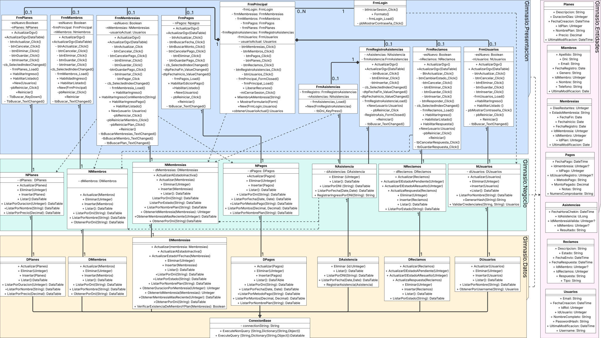

# Arquitectura 4 capas

El sistema está diseñado siguiendo una arquitectura de 4 capas, lo cual es una práctica recomendada para mejorar la organización, mantenibilidad y escalabilidad del software. Las Namespaces que representan a las capas son:

1. **`Gimnasio.Presentacion` (Capa de Presentación):**
    - Responsable de la interfaz de usuario (UI) y la interacción con el usuario.
    - En este sistema, está compuesta por formularios de Windows Forms (clases con prefijo `Frm`), como `FrmLogin`, `FrmPrincipal`, `FrmMiembros`, `FrmPlanes`, etc.
2. **`Gimnasio.Negocio` (Capa de Lógica de Negocio):**
    - Contiene las reglas de negocio, validaciones, cálculos y la lógica central de la aplicación. Actúa como intermediario entre la capa de Presentación y la capa de Acceso a Datos.
    - Las clases en esta capa tienen el prefijo `N` (por ejemplo, `NUsuarios`, `NMiembros`, `NPlanes`).
3. **`Gimnasio.Datos` (Capa de Acceso a Datos):**
    - Encargada de la comunicación directa con la base de datos. Realiza operaciones de Crear, Leer, Actualizar y Eliminar (CRUD) datos.
    - Las clases aquí tienen el prefijo `D` (por ejemplo, `DUsuarios`, `DMiembros`, `DPlanes`). Incluye una clase crucial llamada `Conexion` para gestionar la conexión a la base de datos.
4. **`Gimnasio.Entidades` (Capa de Entidades):**
    - Define las clases que modelan los objetos del dominio del problema (por ejemplo, `Usuarios`, `Miembros`, `Planes`, `Membresias`). Estas son clases que principalmente contienen propiedades para almacenar datos.
    - Esta capa es utilizada por todas las otras capas para transferir datos estructurados.

## Flujo Típico de una Operación

1. Un usuario interactúa con un formulario en la **Capa de Presentación** (ej. `FrmPlanes`).
2. El formulario invoca un método en la clase correspondiente de la **Capa de Negocio** (ej. `NPlanes.Listar()`).
3. La clase de Negocio aplica cualquier lógica o validación necesaria. Si necesita datos, invoca un método en la clase correspondiente de la **Capa de Acceso a Datos** (ej. `DPlanes.Listar()`). En este proceso, puede usar o manipular objetos de la **Capa de Entidades** (ej. `Planes`).
4. La clase de Acceso a Datos, utilizando la funcionalidad heredada de `Conexion`, ejecuta la consulta contra la base de datos. Puede recibir y devolver objetos de la **Capa de Entidades** o `DataTable`.
5. Los datos (o el resultado de la operación) regresan a través de la Capa de Negocio (que puede realizar transformaciones adicionales) y finalmente a la Capa de Presentación para ser mostrados al usuario.
Esta arquitectura promueve una clara separación de responsabilidades, lo que facilita el desarrollo, las pruebas, el mantenimiento y la evolución del sistema de gimnasio.
## Modelo de clases de la implementación del sistema

Se identifican relaciones de:
- **Dependencia (línea punteada y flecha):** Es una relación débil y temporal entre dos elementos, donde uno utiliza los servicios o la información del otro, pero no necesariamente al revés. Por ejemplo, en el evento `btnIniciarSesion_Click` de `FrmLogin`, el formulario necesita validar el usuario y la contraseña. Para ello, crea una instancia de la clase `NUsuarios` dentro del alcance local de `btnIniciarSesion_Click`, dicha instancia solo existe durante la ejecución de ese método y así poder invocar el método `ValidarCredenciales()`. Esta relación no implica que `FrmLogin` mantenga una referencia permanente a `NUsuarios`, sino que la utiliza de manera puntual y transitoria.
- **Asociación (línea):** es una relación más fuerte que la dependencia y representa que una clase mantiene una referencia a otra durante un período de tiempo determinado. Esto implica que una clase tiene un atributo cuyo tipo es otra clase, permitiendo la interacción directa y persistente entre ambas. Por ejemplo, en la clase `NPlanes`, existe un atributo de tipo `DPlanes`, lo que significa que `NPlanes` está asociada a `DPlanes` y puede utilizar sus métodos de consulta a la base de datos de manera continua a lo largo de la vida de la instancia de `NPlanes`.
- **Composicion (linea con rombo negro):** representa una relación fuerte entre clases en donde si el objeto completo se elimina, sus partes se suprimen con el. Esto sucede con `FrmPrincipal` y todos los demas formularios secundarios.
- **Herencia (línea con una flecha hueca):** representa una relación jerárquica entre clases, donde una clase hija  hereda atributos y métodos de una clase base. En este caso, las clases `DPlanes`, `DMiembros`,`DMembresias`, `DPagos`,`DAsistencia`,`DReclamos`, `DUsuarios` heredan de la clase `ConexionBase`. Gracias a esta, todas ellas pueden utilizar directamente los métodos `ExecuteQuery` y  `ExecuteNonQuery` definidos en `ConexionBase` para realizar operaciones de acceso a datos, sin necesidad de re-implementarlos. 
