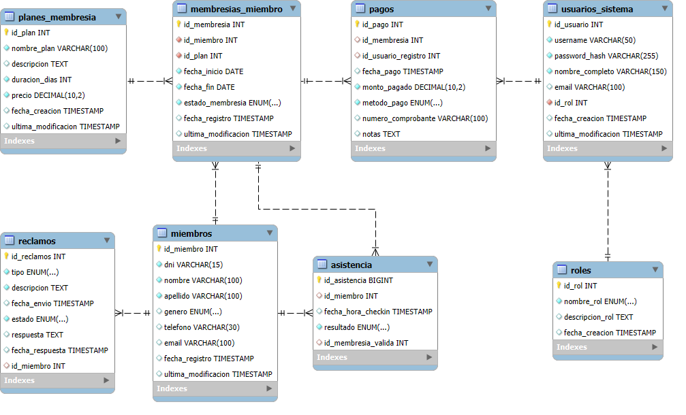
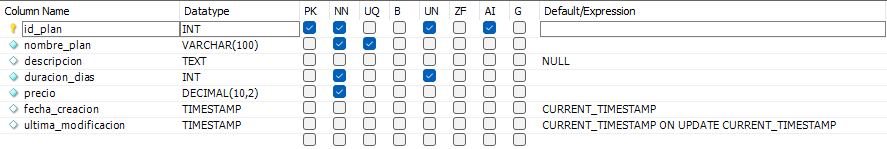
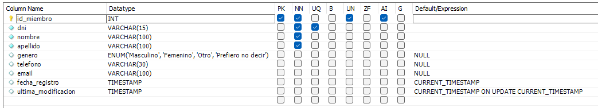
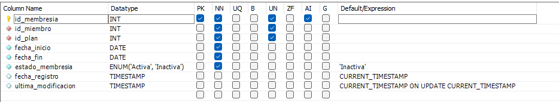
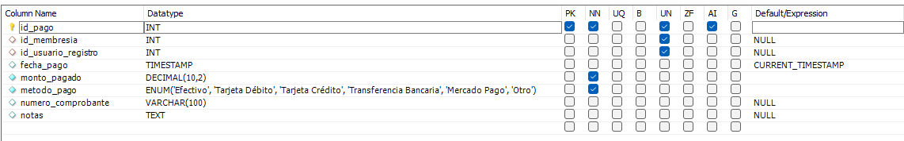
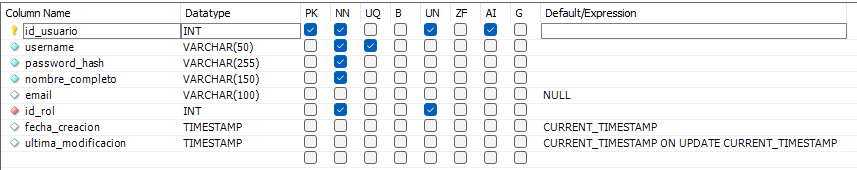
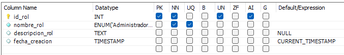
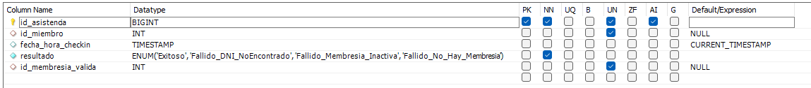
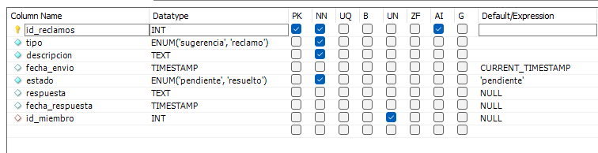

# Base de datos
- Para la base de Datos se utilizo MySql Server y MySql Workbench. Ambos en la version 8.0.42.
- Descarga la base de datos aquí
  👉 [goatym.sql](goatym.sql)

## Diagrama Entidad Relación

## Relaciones
- Cada **plan** puede ser la base para 0 o muchas **membresías**. Cada **membresía** debe estar asociada a un único **plan**. 
- Cada **miembro** puede tener 0 o muchas **membresías**. Cada **membresía** pertenece a un **miembro**.
- Cada **membresía** puede tener 0 o muchos **pagos** asociados (renovaciones). Cada **pago** puede estar vinculado a una **membresía** o a ninguna (si la membresía fue eliminada).
- Cada **pago** es registrado por un **usuario del sistema** o no (en caso de ser borrado). Cada **usuario** del sistema puede registrar 0 o muchos **pagos**.
- Cada **usuario** del sistema le corresponde un **rol** (administrador o recepcionista). Cada **rol** puede tener asociado 0 o muchos **usuarios** del sistema.
- Cada **miembro** puede generar 0 o muchos registros de **asistencias**. Cada intento de **asistencia** puede estar vinculado a un **miembro** o ninguno (en caso de que se ingrese incorrectamente un DNI)
- Cada **membresía** puede validar 0 o muchos intentos de **asistencia**. Cada intento de **asistencia** puede estar vinculado a una **membresía** que permitió el acceso o no (en caso de que este vencida o no exista).
- Cada **miembro** puede realizar 0 o muchos **reclamos**. Cada **reclamo** puede estar asociado a un **miembro** o ninguno (en caso de reclamos anónimos).
## Tablas y sus Características:

1. **Tabla `planes_membresia`**
	- **Descripción:** Define los tipos de suscripciones o planes que ofrece el gimnasio.
	- 
	- **Campos Clave:**
	    - `id_plan` (INT UNSIGNED, NOT NULL, AUTO_INCREMENT): Llave primaria. Identificador único para cada plan.
	    - `nombre_plan` (VARCHAR(100), NOT NULL): Llave única. Nombre descriptivo del plan.
	- **Restricciones de Llave Foránea:** No posee llaves foráneas directas, pero es referenciada por la tabla `membresias_miembro`.
2. **Tabla `miembros`**
	- **Descripción:** Contiene la información de los clientes del gimnasio.
	- 
	- **Campos Clave:**
	    - `id_miembro` (INT UNSIGNED, NOT NULL, AUTO_INCREMENT): Llave primaria. Identificador único para cada miembro.
	    - `dni` (VARCHAR(15), NOT NULL): Llave única. Documento Nacional de Identidad del miembro.
	- **Restricciones de Llave Foránea:** No posee llaves foráneas directas, pero es referenciada por las tablas `asistencia`, `membresias_miembro` y `reclamos`.
3. **Tabla `membresias_miembro`**
	- **Descripción:** Almacena las instancias de suscripción de los miembros a los diferentes planes ofrecidos.
	- 
	- **Campos Clave:**
	    - `id_membresia` (INT UNSIGNED, NOT NULL, AUTO_INCREMENT): Llave primaria. Identificador único para cada membresía de un miembro.
	    - `id_miembro` (INT UNSIGNED, NOT NULL): Llave foránea. Referencia al miembro al que pertenece la membresía.
	    - `id_plan` (INT UNSIGNED, NOT NULL): Llave foránea. Referencia al plan de membresía contratado.
	- **Restricciones de Llave Foránea:**
	    - `fk_membresia_miembro`: `id_miembro` referencia a `id_miembro` en la tabla `miembros`.
	        - ON DELETE RESTRICT: Impide la eliminación de un miembro si tiene membresías asociadas.
	        - ON UPDATE CASCADE: Si se actualiza el `id_miembro` en la tabla `miembros`, se actualizará correspondientemente en esta tabla.
	    - `fk_membresia_plan`: `id_plan` referencia a `id_plan` en la tabla `planes_membresia`.
	        - ON DELETE RESTRICT: Impide la eliminación de un plan si hay membresías de miembros asociadas a él.
	        - ON UPDATE CASCADE: Si se actualiza el `id_plan` en la tabla `planes_membresia`, se actualizará correspondientemente en esta tabla.
4. **Tabla `pagos`**
	- **Descripción:** Registra las transacciones económicas realizadas por los miembros.
	- 
	- **Campos Clave:**
	    - `id_pago` (INT UNSIGNED, NOT NULL, AUTO_INCREMENT): Llave primaria. Identificador único para cada pago.
	    - `id_membresia` (INT UNSIGNED): Llave foránea. Membresía específica que se está pagando o renovando.
	    - `id_usuario_registro` (INT UNSIGNED): Llave foránea opcional. Usuario del sistema que registró el pago.
	- **Restricciones de Llave Foránea:**
	    - `fk_pago_membresia`: `id_membresia` referencia a `id_membresia` en la tabla `membresias_miembro`.
	        - ON DELETE SET NULL: Si se elimina la membresía referenciada, el valor de `id_membresia` en esta tabla se establecerá en NULL.
	        - ON UPDATE CASCADE: Si se actualiza el `id_membresia` en la tabla `membresias_miembro`, se actualizará correspondientemente en esta tabla.
	    - `fk_pago_usuario`: `id_usuario_registro` referencia a `id_usuario` en la tabla `usuarios_sistema`.
	        - ON DELETE SET NULL: Si se elimina el usuario del sistema referenciado, el valor de `id_usuario_registro` en esta tabla se establecerá en NULL.
	        - ON UPDATE CASCADE: Si se actualiza el `id_usuario` en la tabla `usuarios_sistema`, se actualizará correspondientemente en esta tabla.
5. **Tabla `usuarios_sistema`**
	- **Descripción:** Contiene la información de los usuarios (personal del gimnasio) que operan el sistema.
	- 
	- **Campos Clave:**
	    - `id_usuario` (INT UNSIGNED, NOT NULL, AUTO_INCREMENT): Llave primaria. Identificador único para cada usuario del sistema.
	    - `username` (VARCHAR(50), NOT NULL): Llave única. Nombre de usuario para el login.
	    - `id_rol` (INT UNSIGNED, NOT NULL): Llave foránea. Rol del usuario en el sistema.
	- **Restricciones de Llave Foránea:**
	    - `fk_usuario_rol`: `id_rol` referencia a `id_rol` en la tabla `roles`.
	        - ON DELETE RESTRICT: Impide la eliminación de un rol si hay usuarios del sistema asociados a él.
	        - ON UPDATE CASCADE: Si se actualiza el `id_rol` en la tabla `roles`, se actualizará correspondientemente en esta tabla.
6. **Tabla `roles`**
	- **Descripción:** Define los roles de los usuarios que pueden operar el sistema (ej: Administrador, Recepcionista).
	- 
	- **Campos Clave:**
	    - `id_rol` (INT UNSIGNED, NOT NULL, AUTO_INCREMENT): Llave primaria. Identificador único para cada rol.
	    - `nombre_rol` (ENUM('Administrador','Recepcionista'), NOT NULL): Llave única. Nombre del rol.
	- **Restricciones de Llave Foránea:** No posee llaves foráneas directas, pero es referenciada por la tabla `usuarios_sistema`.
7. **Tabla `asistencia`**
	- **Descripción:** Registra los intentos de ingreso (check-ins) de los miembros al gimnasio.
	- 
	- **Campos Clave:**
	    - `id_asistencia` (BIGINT UNSIGNED, NOT NULL, AUTO_INCREMENT): Llave primaria. Identificador único para cada registro de asistencia.
	    - `id_miembro` (INT UNSIGNED): Llave foránea. Referencia al miembro que realizó el check-in.
	    - `id_membresia_valida` (INT UNSIGNED): Llave foránea opcional. ID de la membresía que permitió el acceso exitoso.
	- **Restricciones de Llave Foránea:**
	    - `fk_asistencia_membresia_valida`: `id_membresia_valida` referencia a `id_membresia` en la tabla `membresias_miembro`.
	        - ON DELETE SET NULL: Si se elimina la membresía referenciada, el valor de `id_membresia_valida` en esta tabla se establecerá en NULL.
	        - ON UPDATE CASCADE: Si se actualiza el `id_membresia` en la tabla `membresias_miembro`, se actualizará correspondientemente en esta tabla.
	    - `fk_asistencia_miembro`: `id_miembro` referencia a `id_miembro` en la tabla `miembros`.
	        - ON DELETE CASCADE: Si se elimina el miembro referenciado, se eliminarán también sus registros de asistencia.
	        - ON UPDATE CASCADE: Si se actualiza el `id_miembro` en la tabla `miembros`, se actualizará correspondientemente en esta tabla.
8. **Tabla `reclamos`**
	- **Descripción:** Almacena las sugerencias y reclamos realizados por los miembros.
	- 
	- **Campos Clave:**
	    - `id_reclamos` (INT, NOT NULL, AUTO_INCREMENT): Llave primaria. Identificador único para cada reclamo o sugerencia.
	    - `id_miembro` (INT UNSIGNED): Llave foránea opcional. Miembro que realizó el reclamo o sugerencia.
	- **Restricciones de Llave Foránea:**
	    - `fk_reclamos_miembros1`: `id_miembro` referencia a `id_miembro` en la tabla `miembros`.
	        - ON DELETE SET NULL: Si se elimina el miembro referenciado, el valor de `id_miembro` en esta tabla se establecerá en NULL.
	        - ON UPDATE CASCADE: Si se actualiza el `id_miembro` en la tabla `miembros`, se actualizará correspondientemente en esta tabla.

Adicionalmente, la base de datos cuenta con varias vistas (`vista_asistencia`, `vista_membresias`, `vista_pagos`, `vista_reclamos`, `vista_usuarios`) que simplifican consultas comunes al predefinir uniones entre tablas y seleccionar campos específicos.