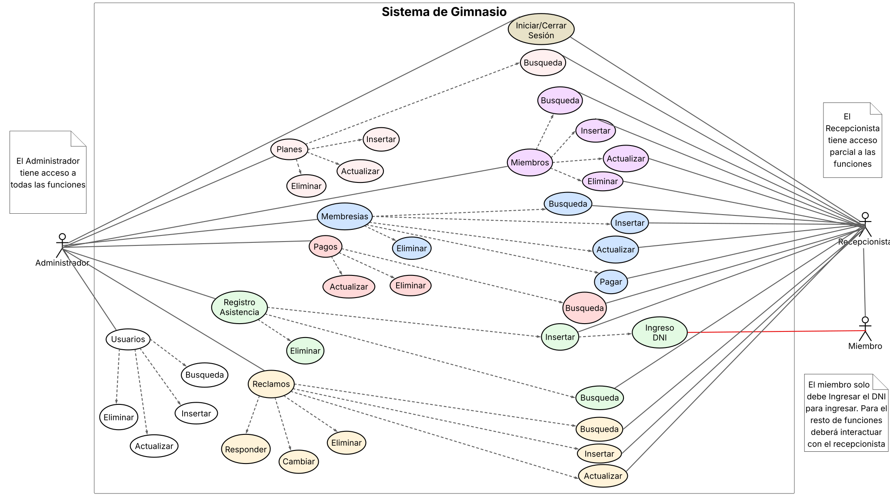

# ¡BIENVENIDOS A GOATYM!💪
## EQUIPO DE DESARROLLO: PROGOAT
- Casas Alan Fernando - EISI 1244
- Diaz Carlos Emanuel - EISI 1225
- Gianello Ramiro Valentín - EISI 1333
## Función Principal
Goatym es un sistema diseñado para gestión de miembros, planes de membresía, pagos, control de asistencia y seguimiento de reclamos para un gimnasio. Además, permite la creación de usuarios con dos roles principales: Administrador y Recepcionista.
## Funciones detalladas del sistema

### Gestión de Planes

| Función                                                                                                                                                                                                                                                                                             | Roles                        |
| --------------------------------------------------------------------------------------------------------------------------------------------------------------------------------------------------------------------------------------------------------------------------------------------------- | ---------------------------- |
| Visualizar un listado completo de los planes. Este listado incluye: nombre del plan, descripción, duración, precio, fecha de creación y fecha de última modificación. Los planes se ordenan por la fecha de última modificación (más reciente primero) y se muestra la cantidad total de registros. | Administrador, Recepcionista |
| Realizar búsquedas de planes por nombre, precio o duración.                                                                                                                                                                                                                                         | Administrador, Recepcionista |
| Insertar nuevos planes en el sistema, ingresando atributos obligatorios (nombre, duración, precio) y opcionales (descripción).                                                                                                                                                                      | Administrador                |
| Actualizar los datos de planes existentes.                                                                                                                                                                                                                                                          | Administrador                |
| Eliminar planes. Esta acción no se permitirá si el plan está asociado a alguna membresía activa.                                                                                                                                                                                                    | Administrador                |

### Gestión de miembros

| Función                                                                                                                                                                                                                                                                                                                | Roles                        |
| ---------------------------------------------------------------------------------------------------------------------------------------------------------------------------------------------------------------------------------------------------------------------------------------------------------------------- | ---------------------------- |
| Visualizar un listado completo de los miembros. Este listado incluye: DNI, nombre, apellido, género, teléfono, email, fecha de registro y fecha de última modificación. Los miembros se ordenan por la fecha de última modificación (más reciente primero) y se muestra la cantidad total de registros.                | Administrador, Recepcionista |
| Realizar búsquedas de miembros por nombre o DNI.                                                                                                                                                                                                                                                                       | Administrador, Recepcionista |
| Insertar nuevos miembros en el sistema, ingresando datos obligatorios (DNI, nombre y apellido) y opcionales (género, teléfono, email). Posteriormente, es posible asignar y procesar el pago de una membresía para el miembro registrado. Estas operaciones pueden cancelarse en cualquier momento durante el proceso. | Administrador, Recepcionista |
| Modificar los datos de miembros existentes.                                                                                                                                                                                                                                                                            | Administrador, Recepcionista |
| Eliminar miembros. Esta acción no se permitirá si el miembro tiene una membresía asignada.                                                                                                                                                                                                                             | Administrador, Recepcionista |

### Gestión de Membresías

| Funcion                                                                                                                                                                                                                                                                                                                                                                                                     | Roles                           |
| ----------------------------------------------------------------------------------------------------------------------------------------------------------------------------------------------------------------------------------------------------------------------------------------------------------------------------------------------------------------------------------------------------------- | ------------------------------- |
| Visualizar un listado completo de las membresías. Este listado incluye: DNI, nombre y apellido del miembro; nombre, precio y duración del plan; fecha de inicio, fecha de fin y estado de la membresía; fecha de registro y fecha de última modificación de la membresía. Las membresías se ordenan por la fecha de última modificación (más reciente primero) y se muestra la cantidad total de registros. | Administrador, Recepcionista    |
| Realizar búsquedas de membresías por DNI del miembro, tipo de plan, o estado (activas/inactivas).                                                                                                                                                                                                                                                                                                           | Administrador, Recepcionista    |
| Insertar nuevas membresias al sistema, seleccionando el miembro y plan.                                                                                                                                                                                                                                                                                                                                     | Administrador, Recepcionista    |
| Confirmar el pago de una membresía, seleccionando el método de pago (obligatorio) y añadiendo opcionalmente el número de comprobante y notas adicionales. Luego del pago, el sistema cambiara el estado de la membresía a activo y actualizara la fecha de vencimiento. Cuando esta llegue a su fin la membresía volverá a estar inactiva.                                                                  | Administrador, Recepcionista    |
| Actualizar la membresía de un miembro, permitiendo el cambio de plan.                                                                                                                                                                                                                                                                                                                                       | Administrador, Recepcionista |
| Eliminar la membresia de un miembro.                                                                                                                                                                                                                                                                                                                                                                        | Administrador                   |

### Gestión de Pagos

| Función                                                                                                                                                                                                                                                                                                                                                                         | Roles                        |
| ------------------------------------------------------------------------------------------------------------------------------------------------------------------------------------------------------------------------------------------------------------------------------------------------------------------------------------------------------------------------------- | ---------------------------- |
| Visualizar un listado de todos los pagos registrados. Este listado detalla: nombre, apellido y DNI del miembro; nombre del plan, monto pagado, método de pago, número de comprobante, fecha de pago y usuario encargado del registro. Los pagos se ordenan por fecha de pago (más reciente primero) y se muestra la cantidad total de registros, así como el total de ingresos. | Administrador, Recepcionista |
| Realizar búsquedas de pagos utilizando filtros por rango de fechas (inicio y fin), DNI del miembro, plan, monto o método de pago.                                                                                                                                                                                                                                               | Administrador, Recepcionista |
| Actualizar los datos de un pago existente.                                                                                                                                                                                                                                                                                                                                      | Administrador                |
| Eliminar registros de pagos                                                                                                                                                                                                                                                                                                                                                     | Administrador                |

### Gestión de Asistencia

| Función                                                                                                                                                                                                                                                                                                                                                                                                                                                                                                                                                                                                           | Roles                        |
| ----------------------------------------------------------------------------------------------------------------------------------------------------------------------------------------------------------------------------------------------------------------------------------------------------------------------------------------------------------------------------------------------------------------------------------------------------------------------------------------------------------------------------------------------------------------------------------------------------------------- | ---------------------------- |
| Registrar la asistencia mediante el ingreso del DNI del miembro. El sistema validará el DNI: - Si el DNI no se encuentra, se informará. - Si el DNI se encuentra pero la membresía está vencida, el ingreso será fallido y no se permitirá el acceso. - Si el DNI se encuentra y la membresía está activa, el ingreso será exitoso y se permitirá el acceso. En los casos de DNI encontrado (ingreso fallido o exitoso), se mostrará un resumen del estado de las membresías del miembro, incluyendo: DNI, apellido, nombre, plan, duración, fecha de inicio, fecha de fin, estado y días restantes. | Administrador, Recepcionista |
| Visualizar el registro de asistencia, que es un listado de todos los intentos de ingreso (exitosos y fallidos). Este listado incluye: DNI, nombre y apellido del miembro, fecha y resultado del ingreso. Los registros se ordenan por fecha de ingreso (más reciente primero) y se muestra la cantidad total de ingresos.                                                                                                                                                                                                                                                                                         | Administrador, Recepcionista |
| Realizar búsquedas en el registro de asistencia por DNI del miembro o por rango de fechas.                                                                                                                                                                                                                                                                                                                                                                                                                                                                                                                        | Administrador, Recepcionista |
| Eliminar registro de asistencia                                                                                                                                                                                                                                                                                                                                                                                                                                                                                                                                                                                   | Administrador                |

### Gestión de Reclamos

| Función                                                                                                                                                                                                                                                                                                                     | Roles                        |
| --------------------------------------------------------------------------------------------------------------------------------------------------------------------------------------------------------------------------------------------------------------------------------------------------------------------------- | ---------------------------- |
| Visualizar un listado completo de los reclamos. Este listado incluye: tipo de reclamo, descripción, fecha de envío, estado (pendiente/resuelto), respuesta, fecha de respuesta y DNI del miembro (si aplica). Los reclamos se ordenan por fecha de envío (más reciente primero) y se muestra la cantidad total de reclamos. | Administrador, Recepcionista |
| Realizar búsquedas de reclamos filtrando por estado (por defecto "pendiente", o "resuelto")                                                                                                                                                                                                                                 | Administrador, Recepcionista |
| Registrar un nuevo reclamo, ingresando tipo y descripción (obligatorios), y DNI del miembro (opcional).                                                                                                                                                                                                                     | Administrador, Recepcionista |
| Actualizar los datos de un reclamo existente.                                                                                                                                                                                                                                                                               | Administrador, Recepcionista |
| Eliminar un reclamo                                                                                                                                                                                                                                                                                                         | Administrador                |
| Cambiar el estado de un reclamo (de pendiente a resuelto, o viceversa).                                                                                                                                                                                                                                                     | Administrador                |
| Responder un reclamo, detallando la resolución del mismo en el sistema.                                                                                                                                                                                                                                     | Administrador                |

### Gestión de Usuarios (Administradores y Recepcionistas)

| Función                                                                                                                                                                                                                                                                                                                                                                                                                                                                                                                                                  | Roles                        |
| -------------------------------------------------------------------------------------------------------------------------------------------------------------------------------------------------------------------------------------------------------------------------------------------------------------------------------------------------------------------------------------------------------------------------------------------------------------------------------------------------------------------------------------------------------- | ---------------------------- |
| Iniciar sesión en el sistema utilizando nombre de usuario y contraseña. - Un inicio de sesión exitoso redirige a una pantalla de bienvenida. - **Rol Administrador:** Acceso completo a todas las funcionalidades del sistema. Las pestañas visibles son: Planes, Miembros, Membresías, Pagos, Asistencia, Registro de Asistencias, Reclamos y Usuarios. También se muestra el nombre del usuario logueado con la opción de "Cerrar Sesión". - **Rol Recepcionista:** Acceso parcial a las funcionalidades, sin acceso a la pestaña "Usuarios". | Administrador, Recepcionista |
| Cerrar la sesión actual del usuario en el sistema.                                                                                                                                                                                                                                                                                                                                                                                                                                                                                                       | Administrador, Recepcionista |
| Visualizar un listado completo de los usuarios del sistema. Este listado incluye: nombre de usuario, hash de contraseña, nombre completo, email, rol (administrador o recepcionista), fecha de creación y fecha de última modificación. Los usuarios se ordenan por la fecha de última modificación (más reciente primero) y se muestra la cantidad total de usuarios.                                                                                                                                                                                   | Administrador                |
| Realizar búsquedas de usuarios por nombre                                                                                                                                                                                                                                                                                                                                                                                                                                                                                                                | Administrador                |
| Insertar nuevos usuarios en el sistema, ingresando datos obligatorios (nombre de usuario, contraseña, nombre completo, rol) y opcionales (email)                                                                                                                                                                                                                                                                                                                                                                                                         | Administrador                |
| Modificar los datos de usuarios existentes, incluyendo la opción de cambiar la contraseña                                                                                                                                                                                                                                                                                                                                                                                                                                                                | Administrador                |
| Eliminar usuarios del sistema.                                                                                                                                                                                                                                                                                                                                                                                                                                                                                                                           | Administrador                |

## Alcance y límites
1. Es una aplicación de escritorio diseñada para la gestión simplificada de un gimnasio.
2. El acceso de los miembros se registra mediante su DNI; el sistema no está diseñado para lectores de huellas digitales u otros métodos de identificación biométrica.
3. El sistema está concebido para operar en un único puesto de check-in y para la gestión de una sola sucursal de gimnasio.
4. El sistema registra únicamente los pagos correspondientes a membresías; no incluye una gestión financiera integral (ej. otros ingresos, egresos, contabilidad).
5. Los roles definidos en el sistema son: Administrador, Recepcionista y Miembro. No se contemplan roles adicionales como entrenadores u otro personal.
6. El sistema no incluye funcionalidades para la gestión de inventario, ni para procesos de compra o venta de productos.
7. Las operaciones en los listados (ej. selección para edición o eliminación) se realizan de forma individual (registro por registro); no se admite selección múltiple.
8. El sistema no cuenta con la funcionalidad de exportar listados a PDF u otros formatos de archivo.

