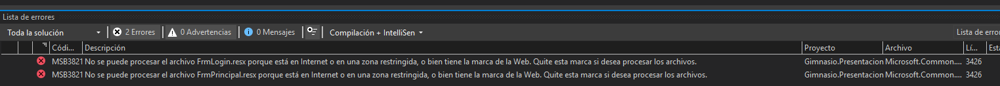
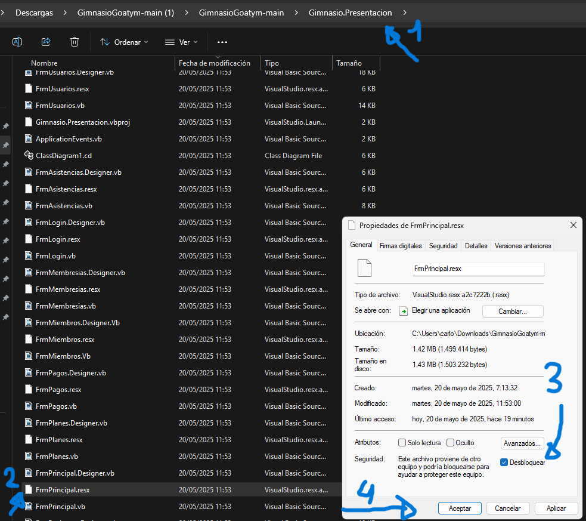
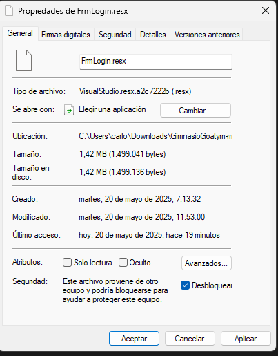

# Manual de Usuario
- Descarga el manual de usuario aquí 👉 [Manual de Usuario](ManualUsuario.pdf)

## Instrucciones de instalación y uso
1. Descargar el archivo zip del proyecto y extraerlo.
2. La base de datos es `goatym.sql` y se encuentra en la carpeta`\Gimnasio.Datos` Tambien se puede descargar en esta misma pagina web en la sección Base de Datos.
3. Importar `goatym.sql` a MySql Workbench.
4. Volviendo a la carpeta raiz del proyecto, abrir `gimnasio.sln` y se abrira en Visual Studio 2022
5. Configurar la cadena de conexión de acuerdo a su base de datos, la cadena de conexion se encuentra en `Gimnasio.Datos\Conexion.vb`
6. Al compilar el Proyecto, dara el siguiente error:

7. Para solucionarlo hay que quitar las marcas que pone la Web en los archivos indicados de la siguiente forma:

8. Luego, ya se podra compilar y ejecutar el proyecto.
9. Para usar el sistema sin el Visual Studio 2022, luego de compilar el proyecto, se puede usar el archivo `Gimnasio.Presentacion.exe` que se encuentra en la carpeta `Gimnasio.Presentacion/bin/Debug/net9.0-windows`
10. Cuentas de prueba de roles Administrador y Recepcionista.
    - Usuario: admin 
    - Contraseña: 1234
    - Usuario: recep
    - Contraseña: 1234
11. Para realizar un seguimiento de los errores, existe un registro de errores `log.txt` que se encuentra en `Gimnasio.Presentacion\bin\Debug\net9.0-windows\Logs\log.txt`

